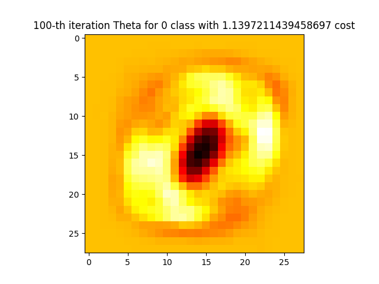

This project implements linear regression, logistic regression and softmax regression learning algorithms and various methods of minimalizing cost functions
# General overview
A Regression class from which other regression classes inherit implements core features for Generalized Linear Models such as:

-Batch gradient descent method

-Stochastic gradient descent method

-core train function

-test function, that shows results of minimalization methods mentioned above

Each child class implements its own cost function, hypothesis and predict function 
Linear and Logistic regressions additionally implement another optimization methods such as Normal Equation and Newton's method

Utils.py file contains functions for reading data for Softmax Regression clasification of handwritten digits and functions for mapping features into higher dimensions

Linear and Logistic plots are result of running algorithms with quadratic features and Softmax doesn't use any mapping

# Plots
Plots included below are results of algorithms running on examplary data 

## Linear Regression
Examplary 1-D data

## LogisticRegression
Examplary 2-D data

## Softmax Regression
MNIST Handwritten Digits Dataset, accuracy of around 87%

A visualization of Theta for first 4 digits 

